# opencode-claude



Use your Claude Pro/Max subscription as a model provider in [OpenCode](https://opencode.ai) and [OpenChamber](https://github.com/openchamber/openchamber), on both plugin APIs (V1 and V2), through Anthropic's official Agent SDK and your local `claude` CLI. No API key, and the plugin never touches credentials: the CLI owns sign-in and tokens.

> **This is a fork** of [openchamber/opencode-claude](https://github.com/openchamber/opencode-claude), branched after upstream v0.14.0. It adds a native OpenCode V2 plugin and reworks most of the proxy (see below). Its package, `@josuegalre/opencode-claude`, is not on npm yet; `@openchamber/opencode-claude` on npm is upstream's package, without these changes. [Install from source](#install).

## What this fork adds

The full list is in [CHANGELOG.md](CHANGELOG.md) under *Unreleased*. The highlights:

- **Native OpenCode V2 plugin.** A `Plugin.define` entry registers the `claude-code` provider, its model catalog and a *Sign in with Claude Code CLI* integration. Its `model.request` hook tags every request with the session, project directory, effort variant and request kind. V2 loads the checkout directory directly and reloads it on its own when `dist/` changes.
- **OpenCode's tools, faithfully.** Tools are bridged with their full parameter schemas. Read-only tools are marked `readOnlyHint`. All calls from one message reach OpenCode in a single `tool_calls` response, so subagents launched together run in parallel. A message you send mid-turn is delivered with the next tool result, and Claude is told how to use V2's code-mode `execute` tool.
- **Your agent's prompt reaches Claude, without OpenCode's boilerplate.** Custom agent prompts, `Instructions from:` files, MCP notes and the skills list are appended to the Claude Code system prompt. OpenCode's stock base prompt and its `# Your Model` / `<env>` sections are dropped: when they reach the request, Anthropic treats it as a third-party app and rejects it (`400 Third-party apps now draw from your extra usage`).
- **Sessions that hold up.** Each OpenCode session is bound to one Claude session and resumes it. If the host rewrites the history (compaction, pruning plugins) or another provider answered some turns, the stale Claude session is dropped and the turn is rebuilt from the host's history. Every message queued since the last reply is sent, not just the newest. A turn waiting on tool results is closed after an hour instead of leaking a CLI process.
- **Compaction and titles on V2.** Requests are routed by V2's request kind, not by prompt wording. A compaction sent while a turn is waiting on a tool call runs as a one-shot, tool-less summary instead of replaying that tool call.
- **Real HTTP errors.** An API error that arrives before any output returns a real HTTP status, keeping Anthropic's own 4xx, instead of a 200 whose only text is the error. Before, only rate limits got a real status. The rate-limit gate parses dated weekly resets and no longer blocks turns until the reset of an unrelated limit.
- **Hardening.** The proxy requires a per-process secret and rejects requests sent from a browser page. Claude Code's built-in tools are never enabled, so every tool call goes through OpenCode's permission rules. The CLI installer no longer pipes `curl` into `bash`.
- **Models and usage.** Pinned Fable 5.1 and Opus 5.5. 1M-context models declare a 900k input window, so OpenCode auto-compacts before hitting the limit. Token usage is reported per turn, with the final completion count.

## Requirements

- OpenCode V2 (tested on 2.0.15), or OpenCode V1 ≥ 1.18.29
- [Claude Code CLI](https://docs.anthropic.com/en/docs/claude-code), signed in with a plan Claude Code supports. If it's missing, the sign-in action installs it first. Besides `PATH`, the plugin looks in `~/.local/bin` and the npm global bin.
- [Bun](https://bun.sh) to build

## Install

### 1. Build the checkout

```bash
git clone https://github.com/JosueGalRe/opencode-claude.git
cd opencode-claude
bun install
bun run build
```

### 2. Load it in OpenCode

One entrypoint serves both APIs: V2 reads the `Plugin.define` definition (`server.js` when loaded from a directory), and V1 calls `server()`.

**OpenCode V2.** Add the directory to `plugins` in `~/.config/opencode/opencode.json`. The plugin registers the provider, the models and the sign-in on its own:

```jsonc
{
  "plugins": ["file:///absolute/path/to/opencode-claude"]
}
```

**OpenCode V1.** Add it to `plugin`, together with a `claude-code` provider entry. Running `opencode plugin file://$PWD` from the checkout writes the `plugin` entry for you.

```jsonc
{
  "$schema": "https://opencode.ai/config.json",
  "plugin": ["file:///absolute/path/to/opencode-claude"],
  "provider": {
    "claude-code": { "name": "Claude Code" }
  }
}
```

`claude-code` is not a built-in provider. Until the plugin loads, `opencode auth login --provider claude-code` fails with `Unknown provider "claude-code"`.

### 3. Sign in

The plugin runs the official CLI login, `claude auth login --claudeai`. The host opens the sign-in page the CLI asks for, and you paste the code Claude shows back into the host. The CLI does the exchange and keeps the credentials.

- **V2:** connect the **Claude Code** provider and pick **Sign in with Claude Code CLI**. The host stores only a secret-free marker so the provider shows as connected, and each refresh checks that the CLI is still signed in.
- **V1:** run `opencode auth login --provider claude-code` and pick **Sign in with Claude Code CLI**. When the CLI is missing, the option is **Install Claude Code CLI and sign in** instead: it runs `npm i -g @anthropic-ai/claude-code` (Anthropic's install script as fallback) and then signs you in.
- **Terminal:** `claude auth login` works for both.

The plugin doesn't implement OAuth, read Claude's credential files, inject tokens, or call Anthropic endpoints itself. Every request, titles and summaries included, runs through the Agent SDK.

### 4. Pick a model

Choose provider **Claude Code**, a model, and an effort variant. From the V1 CLI:

```bash
opencode run "Summarise this repository in five bullets." --model claude-code/sonnet
```

## Models and effort

| Model id | Name | Context |
| --- | --- | --- |
| `fable` · `opus` · `sonnet` | Fable 5 · Opus 5 · Sonnet 5 (aliases; the CLI picks the concrete model) | 1M |
| `haiku` | Haiku 4.5 | 200k |
| `claude-fable-5-1` · `claude-opus-5-5` · `claude-opus-4-8` · `claude-sonnet-4-6` | Pinned versions | 1M |

The effort variants `low` · `medium` · `high` · `xhigh` · `max` map to Claude Code's `--effort` with adaptive thinking. Title and summary requests run without effort or thinking.

## How it works

```text
OpenCode ──POST /v1/chat/completions──▶ local proxy (Bun.serve on 127.0.0.1, per-process secret)
                                          └─ Agent SDK query()
                                               └─ claude CLI (your subscription)
                                                    └─ mcp__opencode__<tool> ──▶ back to OpenCode as tool_calls
```

- **Provider.** OpenCode sees an OpenAI-compatible provider. The proxy binds an ephemeral port that the plugin publishes to OpenCode, and the plugin adds the proxy secret to every request.
- **Tools.** OpenCode's tools are exposed to Claude as an in-process MCP server. When Claude calls one, the proxy pauses the turn ("parks" it) and answers OpenCode with `tool_calls`. OpenCode runs the tool under its own permissions, and the next request carries the results, which resume the paused turn.
- **Sessions.** Session bindings are stored in `sessions.json`. When a Claude session can't be resumed, or no longer matches the host's history, the prior conversation is serialized into the prompt (newest first, within a character budget) so Claude doesn't start without context.
- **Titles and compaction.** These run as single-turn, tool-less requests that don't create or resume sessions. A compaction also closes any turn that is waiting on a tool call, and the next normal turn rebuilds from the compacted history.
- **Failures.** If a turn fails before any output, the response is 401 (auth), 429 with `Retry-After` (subscription limit), Anthropic's 4xx (request refused) or 500. If it fails after output has started, the error is appended to the stream as `[claude-code error] …`. A rate limit hit mid-turn goes out as a retryable stream error, so OpenCode waits for the reset and retries. A turn that goes silent for 10 minutes is killed.

State lives in `$XDG_DATA_HOME/opencode-claude/` (default `~/.local/share/opencode-claude/`):
- `sessions.json`: session bindings.
- `rate-limit.json`: limit state.
- `proxy-token`: only with a pinned port.
- `debug.log`.

## Configuration

Set these environment variables for the OpenCode server process:

| Variable | Default | Effect |
| --- | --- | --- |
| `OPENCODE_CLAUDE_DEBUG` | off | `1` adds info-level logs. Warnings and errors always go to stderr and `debug.log`. |
| `OPENCODE_CLAUDE_PROXY_PORT` | ephemeral | Pin the proxy port. Processes sharing the port share the secret through `proxy-token` (mode 0600), and one takes the port over if its owner exits. |
| `OPENCODE_CLAUDE_CWD` | request's project directory | Force the working directory of every Claude turn. |
| `OPENCODE_CLAUDE_FORWARD_SYSTEM_CONTEXT` | on | `0` stops forwarding the agent prompt, instructions, MCP notes and skills list. |
| `OPENCODE_CLAUDE_HOST_TRANSCRIPT` | on | `0` disables the history check: Claude sessions are resumed even if the host's history changed. Changes to the system prompt alone (model, agent, date) never count as a change. |
| `OPENCODE_CLAUDE_HISTORY_MAX_CHARS` | `400000` | Character budget for the conversation copied into a new Claude session. `0` disables the copy. |
| `OPENCODE_CLAUDE_PARKED_TURN_TTL_MS` | `3600000` | How long a turn can wait for tool results before its CLI process is closed. `0` = no limit. Results that arrive later still work: the turn is rebuilt with the history copied in. |
| `OPENCODE_CLAUDE_STRUCTURED_OUTPUT_REAP_MS` | `60000` | Grace period for a turn waiting only on `StructuredOutput`, which OpenCode never answers. |
| `OPENCODE_CLAUDE_TURN_STALL_MS` | `600000` | Silence after which a turn is killed with an error (minimum `1000`). |
| `OPENCODE_CLAUDE_RATE_LIMIT_FAST_FAIL` | on | `0` disables the 429 gate: turns are attempted even during a known limit. |
| `OPENCODE_CLAUDE_RATE_LIMIT_STORE` | `rate-limit.json` in the state dir | Override the limit store path (tests). |

## Proxy endpoints

| Endpoint | Access | Returns |
| --- | --- | --- |
| `POST /v1/chat/completions` | Secret required (`Authorization: Bearer …` or `x-opencode-claude-token`). Requests with an `Origin` header are rejected. | Chat turns. |
| `GET /v1/models` | Open | Model catalog. |
| `GET /v1/rate-limit` | Open | `{ limited, status, rateLimitType, utilization, resetsAt, resetsAtISO, resetInSeconds, message, updatedAt }`, for a "limits reset in …" countdown. |
| `GET /health` | Open | Liveness, plus a compact `rateLimit` summary. |

During a confirmed subscription limit, new turns get 429 with `Retry-After` and `x-claude-rate-limit-reset` until the reset. After that, the next turn resumes the same Claude session.

## Troubleshooting

| Symptom | What to check |
| --- | --- |
| `Unknown provider "claude-code"`, or no Claude Code provider | The plugin didn't load. Check the path in your config and that `dist/index.js` exists (`bun run build`). V1 needs a restart; V2 reloads on its own. |
| Authentication error | Run `claude auth login`, then `claude auth status`. |
| 401 from the proxy | The request lacks the proxy secret. Use the provider the plugin registers, not a hand-written `baseURL`. |
| 429 / limit reached | `GET /v1/rate-limit` shows the reset time. The gate lifts itself then. |
| `400 Third-party apps now draw from your extra usage` | An OpenCode-style environment section reached Claude. The stock ones are stripped, so look for a `# Your Model` or `<env>` block in your custom agent prompt; `OPENCODE_CLAUDE_FORWARD_SYSTEM_CONTEXT=0` confirms it. |
| `API Error: … safeguards flagged this message … Details: [category]` | Anthropic's safety classifier stopped the model's response; this isn't a plugin error. Rephrase, switch models for that turn, or start a new session. |

## Development

```bash
bun install
bun run build       # .d.ts files via tsc, then a single bundled dist/index.js via bun build
bun run test        # offline: smoke.ts + every test/*-regression.ts, each in its own process
bun run test:haiku  # live checks against a signed-in CLI (Haiku)
```

- **Hot reload on V2.** V2 watches the plugin's files, so a rebuild is enough; you don't need to restart `opencode serve`. A reload stops the proxy, which cuts off any turn in flight, including one waiting on a tool call. When that tool result arrives, the turn is rebuilt from history. Saving `package.json` reloads it too, and so does `bun run test`, whose `smoke.ts` ends with a build. Build, test and edit `package.json` between turns.
- **CI.** `.github/workflows/ci.yml` builds and runs the tests on pushes to `main` and on pull requests. `release.yml` is manual: it bumps the version, tests and builds, tags the release commit on `main`, publishes `@josuegalre/opencode-claude` to npm (needs an `NPM_TOKEN` secret) and creates the GitHub release.

## Credits

Forked from [openchamber/opencode-claude](https://github.com/openchamber/opencode-claude) by Serhii Dziupin, Bohdan Triapitsyn and contributors. The Agent SDK proxy, the CLI-owned authentication, the park/resume tool bridge and the rate-limit gate all come from there. Built on Anthropic's Claude Agent SDK and the Claude Code CLI.

## License

[MIT](LICENSE), keeping upstream's copyright notice.
